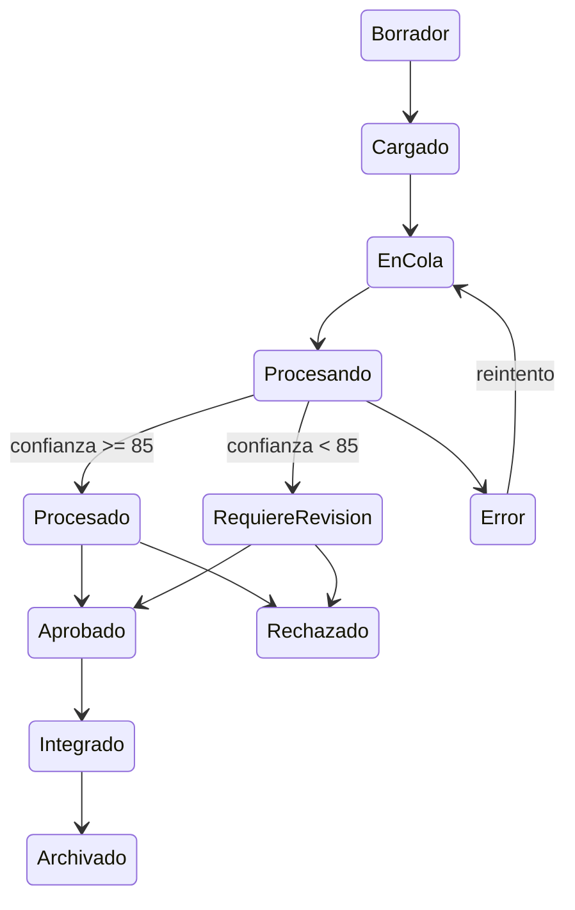
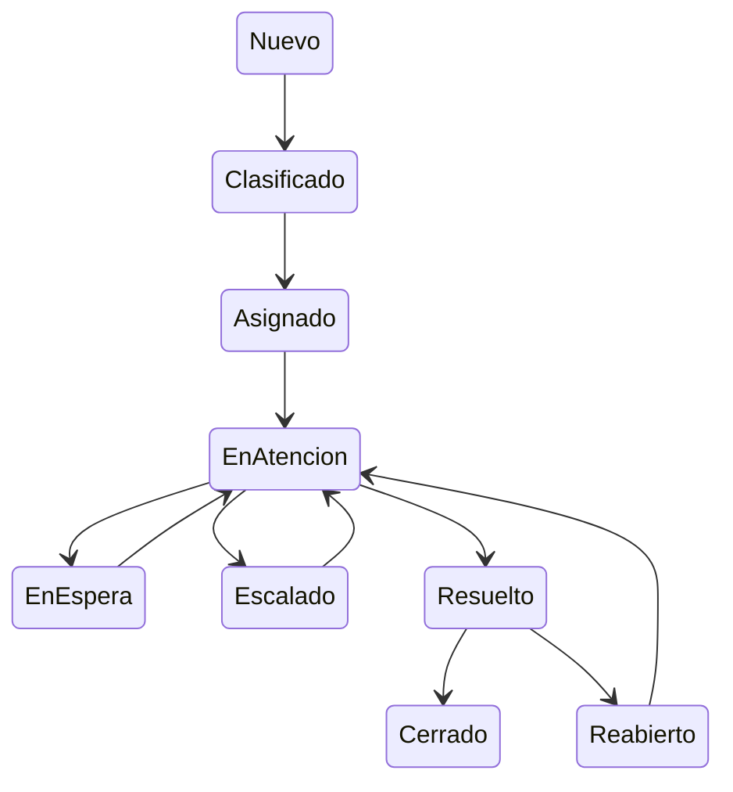
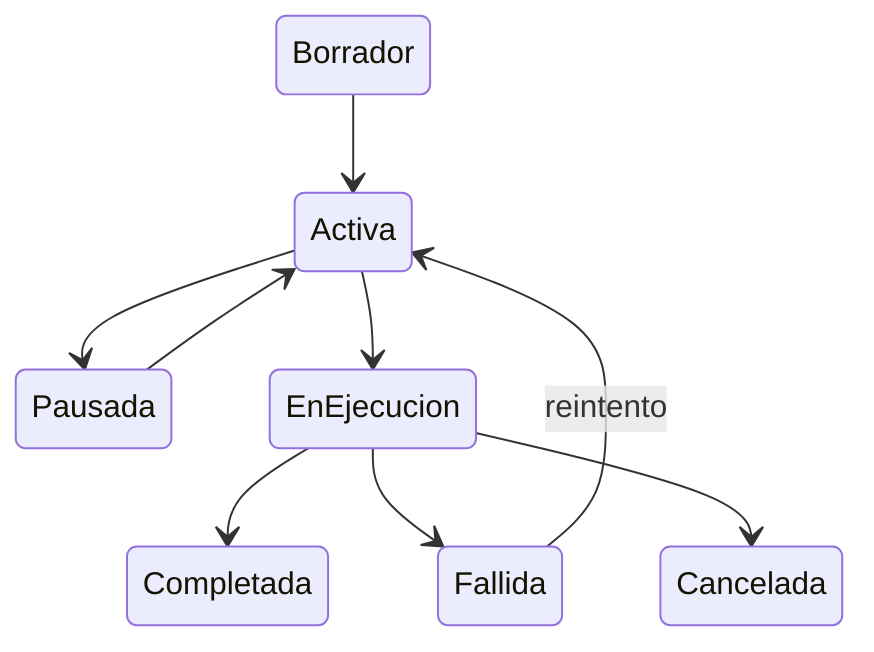
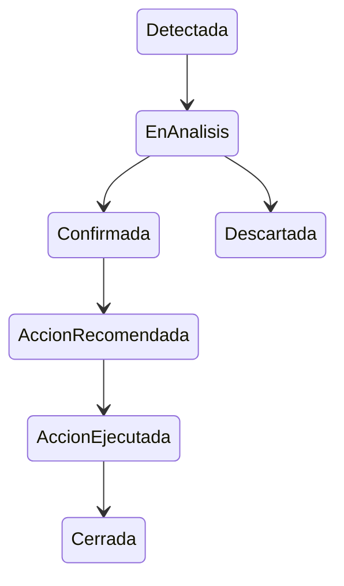
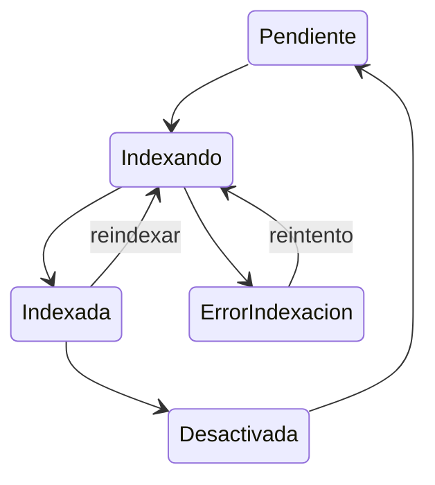
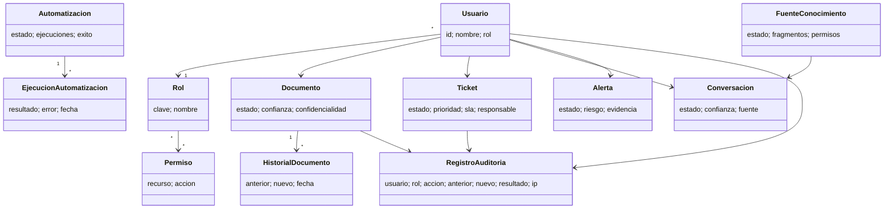

# Flujos y estados

Las reglas ejecutables viven en `assets/js/state-machine.js`. La interfaz presenta transiciones autorizadas y el motor vuelve a validar rol, estado y requisitos antes de persistir.

## Documento

## Ticket

## Automatización, alerta y RAG

## Transiciones críticas

| Transición | Rol | Condición | Resultado |
|---|---|---|---|
| Documento → Aprobado/Rechazado | Supervisor, Administrador | Procesado/revisión; rechazo con motivo | Historial y auditoría |
| Documento → Integrado | Supervisor, Administrador | Aprobado | Integración simulada |
| Ticket → Asignado | Soporte, Supervisor, Administrador | Responsable obligatorio | Responsable persistido |
| Ticket → Escalado/Resuelto | Soporte, Supervisor, Administrador | Motivo/solución | Historial actualizado |
| Automatización → En ejecución | Supervisor, Administrador | Activa | Ejecución e indicador |
| Alerta → Confirmada/Descartada | Supervisor, Administrador | Responsable/justificación | Evidencia trazable |
| Fuente → Indexando | Analista, Supervisor, Administrador | Pendiente, indexada o error | Progreso y fragmentos |

## Diagrama de clases

